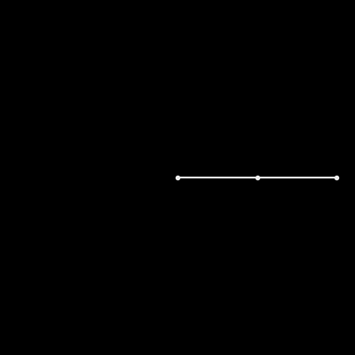
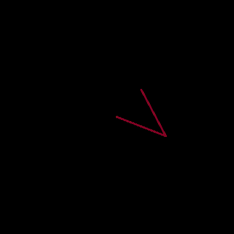

# Double Pendulum

Generate one or multiple double pendulums and admire their chaoticness.

     
     

## Installation
`$ git clone https://github.com/dnellessen/double-pendulum.git`\
or download ZIP.

## Usage
Play around with the values when creating a Pendulum object and see how it affects the behavior.

- `python3 /path/single.py`
- `python3 /path/many.py`